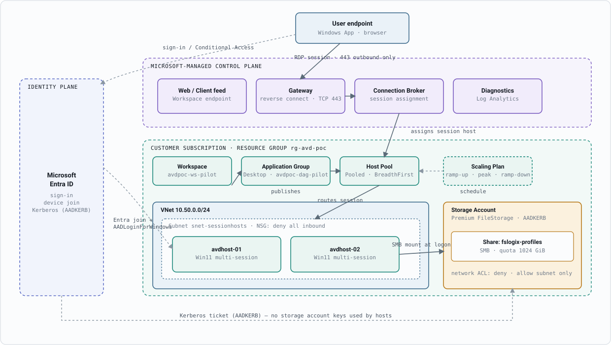

# Azure Virtual Desktop — Architecture & Access Reference

A working reference build — one host pool, FSLogix profile storage, autoscaling, and two
Entra-joined session hosts — documented here as the architecture, access model, and
terminology map an infrastructure engineer coming from Remote Desktop Services needs to
operate it.

| | |
|---|---|
| Host pool | Pooled &middot; BreadthFirst |
| Identity | Microsoft Entra ID join |
| Profiles | FSLogix on Azure Files (AADKERB) |
| Network | No public IP, no inbound RDP |
| Delivery | Bicep &middot; GitHub Actions &middot; OIDC |

## Contents

- [Architecture](#architecture)
- [User access](#user-access)
- [Platform glossary](#platform-glossary)
- [Security posture](#security-posture)
- [Delivery pipeline](#delivery-pipeline)
- [References](#references)

## Architecture

In an RDS farm you own every tier: the Connection Broker VM, the RD Gateway VM, the RD
Web Access site, the licensing server, the session host pool, and the load-balancer or
DNS round-robin in front of it. Azure Virtual Desktop keeps that same shape conceptually,
but the broker, gateway, and web feed become a Microsoft-managed service you call by API
— there is no VM to patch for any of them.

What's left for the customer to run is narrower but not smaller in importance: the
virtual network, the session host VMs and their image, the FSLogix profile store, and
the identity plane that ties it together. The diagram below is this build's actual
resource layout in `rg-avd-poc` (uksouth) — one VNet, one host pool, two session hosts,
one storage account.



**Fig. 1.** Runtime architecture of the pilot build. The Microsoft-managed band (violet)
has no customer VM in it — that's the entire broker/gateway/web-access tier of an RDS
deployment collapsed into a service you call, not a server you patch. Everything else is
a standard ARM resource in the customer's own resource group.

Legend:

- **Violet** — Microsoft-managed service
- **Indigo** — Identity plane (Microsoft Entra ID)
- **Teal** — Customer-managed AVD objects (host pool, app group, workspace, scaling plan, session hosts)
- **Slate blue** — Network (VNet / subnet / NSG)
- **Amber** — Storage (FSLogix)
- Solid lines = data/control path &middot; dashed lines = identity, schedule, or Kerberos auth path

### Shared responsibility, restated for people who've run the on-prem version

**Microsoft operates**

- Connection Broker — session assignment logic, load-balancing across the pool
- Gateway — TLS termination and the reverse-connect transport (no inbound firewall rule, ever)
- Web/client feed — what used to be the RD Web Access IIS site
- Service-side patching, scaling, and availability of all of the above

**Customer operates**

- Session host VMs, their image, and patch cadence
- Host pool, workspace, and application group configuration
- FSLogix profile storage, network ACLs, and identity join method
- Scaling schedule, RBAC assignment, and network topology (VNet/NSG/peering)

Reference: [Azure Virtual Desktop service architecture and resilience](https://learn.microsoft.com/en-us/azure/virtual-desktop/service-architecture-resilience), Microsoft Learn.

## User access

There's no RD Gateway CAP/RAP pair to configure and no local "Remote Desktop Users"
group on each host to keep in sync — but unlike a hybrid-joined host, an Entra-ID-joined
one needs **two** separate Azure RBAC role assignments, not one, plus whatever
Conditional Access policy applies to the user's Entra identity. This build originally
shipped with only the first, which is exactly the gap that left the pilot's host
reachable and registered while every real user connection was denied.

```powershell
# 1. Feed visibility — lets the desktop show up in the user's workspace
az role assignment create `
  --assignee <user-object-id-or-upn> `
  --role "Desktop Virtualization User" `
  --scope <application-group-resource-id>

# 2. VM sign-in — the piece that's easy to miss. AADLoginForWindows makes the
# host Entra-joined, but it does not by itself authorize any Entra identity to
# sign in to it; that authorization is this separate role, scoped per VM (or
# resource group, to cover every host at once).
az role assignment create `
  --assignee <user-object-id-or-upn> `
  --role "Virtual Machine User Login" `
  --scope <session-host-vm-resource-id>
```

`Desktop Virtualization User` grants nothing beyond "see and use this desktop" — no
rights over the host pool or storage account. `Virtual Machine User Login` grants
nothing beyond "sign in to this specific VM" — no Contributor/Reader rights over it.
Together they're the equivalent of RDS's "add user to the collection" step, expressed
as two narrowly scoped ARM roles instead of one local group membership that used to
live only on the broker.

1. **Sign-in.** User opens the Windows App (or `client.wvd.microsoft.com`) and
   authenticates against Microsoft Entra ID — MFA and Conditional Access apply exactly
   as they would for any other app.
2. **Feed resolution.** The client queries the Workspace endpoint, which returns only
   the application groups the signed-in identity holds `Desktop Virtualization User` on.
3. **Reverse-connect session.** The client opens an outbound TLS connection to the
   Gateway on 443. No inbound port is opened anywhere — including on the session hosts,
   which sit behind an NSG that denies all inbound traffic.
4. **Broker assignment.** The Connection Broker picks an available host in the pool
   using the pool's load-balancing algorithm (`BreadthFirst` here, to spread load;
   `DepthFirst` is the alternative, used during ramp-down to consolidate and free hosts).
5. **Host authentication.** The session host — already Entra-joined via the
   `AADLoginForWindows` extension — authenticates the connecting user against Entra ID
   directly, authorized by the `Virtual Machine User Login` role above. No Active
   Directory Domain Services controller in the path for this pilot.
6. **Profile mount.** At logon, FSLogix mounts the user's profile VHD(X) from the Azure
   Files share over SMB, using a Kerberos ticket obtained via the storage account's
   AADKERB configuration — not a stored access key.

### What's structurally different from an RDS access model

- **No local group to reconcile.** RDS access usually ends up as some combination of AD
  security groups and a local group on the broker or each host. Here it's two narrowly
  scoped RBAC assignments (application group + VM), both auditable in the Activity Log.
- **No CAP/RAP policy pair.** Connection Authorization and Resource Authorization
  Policies on RD Gateway are replaced by a Conditional Access policy evaluated at Entra
  sign-in — before the client ever reaches the Gateway.
- **No NTFS/share permission dance per collection.** FSLogix's access to its own share
  is enforced by network ACL (VNet-only) plus Entra Kerberos auth, not per-user NTFS
  ACLs layered on a file server.

## Platform glossary

Most of what changes between RDS and AVD is vocabulary and where the component runs, not
the underlying concept.

| On-prem RDS | Azure Virtual Desktop | What actually changes |
|---|---|---|
| RD Connection Broker (VM) | Connection Broker | Becomes a Microsoft-managed PaaS service — no VM, no patching, no HA pair to design. |
| RD Gateway + firewall NAT rule | Gateway (reverse connect) | Outbound-only from the host; no inbound port ever opened, so no gateway VM or public IP to secure. |
| RD Web Access (IIS site) | Workspace / feed | A service endpoint the client queries; nothing to host or certificate-bind yourself. |
| Session Collection | Host Pool | Same idea — a set of identically configured hosts — now an ARM resource with its own registration tokens. |
| RemoteApp / Desktop Collection publishing | Application Group | Splits into `RemoteApp` or `Desktop` type; is what RBAC is actually scoped to, not the host pool. |
| User Profile Disk (UPD) | FSLogix Profile Container | Same VHD(X)-per-user model; adds faster mount, Office/Teams-aware container types, and Entra Kerberos auth to the file share. |
| RD Licensing server + CALs | Per-user access rights via Microsoft 365 / Windows entitlement | No licensing server role; entitlement is tracked against the signed-in identity's license SKU instead. |
| NLB / DNS round-robin across RDSH farm | Host pool load-balancing algorithm | `BreadthFirst` (spread) or `DepthFirst` (consolidate) — a pool property, not external infrastructure. |
| Manual scripted VM start/stop for cost control | Scaling Plan (autoscale) | A first-class ARM resource with ramp-up / peak / ramp-down / off-peak schedules, assignable to multiple pools. |
| AD DS domain join of every RDSH | Microsoft Entra ID join | Removes the AD DS dependency entirely for pilots like this one; hybrid join remains an option where legacy apps need it. |
| App-V sequencing / golden-image app installs | MSIX app attach | Apps stream from a packaged image at sign-in instead of being baked into every host image. |

**Session host** — Functionally the same thing as an RDSH server: a Windows machine
that renders the actual desktop or app. The differences here: it's Entra-joined instead
of AD-joined, it self-registers into the host pool via an agent and a registration token
instead of being manually added to a collection, and it typically runs the multi-session
SKU of Windows 11/10 Enterprise, which is licensed specifically for AVD.

**FSLogix** — The profile-virtualization technology Microsoft acquired and now ships as
the default profile solution for AVD (it replaced native UPD). It redirects the entire
user profile into a VHD(X) that's dynamically attached at logon, so the profile is
portable across any host in the pool — the same problem UPDs solved on RDS, with faster
mount times and container types tuned for Outlook/Teams caches.

## Security posture

Small deployment, but every control below is the same one a production estate needs —
nothing here is a pilot-only shortcut.

- **No public IP or inbound RDP on any session host** *(NSG: deny all inbound)* — All
  connectivity to session hosts arrives through the Gateway's reverse-connect transport.
  The subnet NSG denies 100% of inbound traffic as a defence-in-depth backstop — there
  is no rule that needs to permit 3389 from anywhere, ever.
- **Microsoft Entra ID join, no AD DS dependency** *(AADLoginForWindows)* — Removes an
  entire tier (domain controllers, site topology, replication health) from the pilot's
  operational surface. Hybrid join remains available where line-of-business apps still
  need Kerberos against on-prem AD.
- **FSLogix storage locked to the VNet, Kerberos not keys** *(AADKERB &middot; network ACL)*
  — The storage account's public network access is disabled and its ACL allows only the
  session-host subnet. Hosts authenticate to the share with a Kerberos ticket from Entra
  ID — no storage account key is ever handed to a session host.
- **Least-privilege RBAC on the user path** *(Desktop Virtualization User &middot;
  Virtual Machine User Login)* — Users hold exactly two roles: `Desktop Virtualization
  User` on the application group (feed visibility) and `Virtual Machine User Login` on
  each session host (sign-in rights) — not host pool admin, not Contributor on the
  resource group or the VM. Azure Virtual Desktop ships separate Contributor/Reader
  roles per host pool, per application group, and per workspace specifically so
  administrative and end-user access never have to share a role.
- **Static analysis gates every template change** *(Checkov &middot; PSRule for Azure)* —
  Every pull request touching Bicep runs Checkov (hard gate — fails the build) and
  PSRule for Azure's Well-Architected security-pillar ruleset against the templates
  before anything is deployed.

## Delivery pipeline

The templates deploy through GitHub Actions using OIDC federated credentials — no
long-lived Azure secret is stored in the repository at any point.

1. **Pull request opened** against any `.bicep` / `.bicepparam` file.
2. **Automated checks run** — Checkov and PSRule for Azure scan the templates (no Azure
   credentials needed, so this runs even on forked PRs), and a What-If deployment shows
   the exact resource delta.
3. **Merge to main** re-runs the security scan, then **pauses for manual approval** in a
   protected `production` environment — the equivalent of a documented change-approval
   gate before any RDS farm change.
4. **Approved deploy applies** via `az deployment group create`, authenticated by a
   short-lived OIDC token exchanged for the GitHub Actions run's identity — nothing
   stored, nothing to rotate.

The host pool's registration token can't be reliably read back inside the same
deployment that creates it (an ARM evaluation-order limit), so session-host deployment
is a deliberate second pass: fetch a fresh token via CLI once the host pool exists, then
deploy the hosts with it as a parameter. In production this maps naturally onto how
token rotation is handled anyway, since tokens expire independently of the surrounding
infrastructure.

## References

**Architecture & control plane**
- [What is Azure Virtual Desktop?](https://learn.microsoft.com/en-us/azure/virtual-desktop/overview)
- [Service architecture and resilience](https://learn.microsoft.com/en-us/azure/virtual-desktop/service-architecture-resilience)
- [Azure Virtual Desktop terminology](https://learn.microsoft.com/en-us/azure/virtual-desktop/terminology)
- [Virtual desktop architecture design guide](https://learn.microsoft.com/en-us/azure/architecture/virtual-desktop/virtual-desktop-get-started) (Azure Architecture Center)

**Identity & access**
- [Built-in RBAC roles for Azure Virtual Desktop](https://learn.microsoft.com/en-us/azure/virtual-desktop/rbac)
- [Understanding network connectivity (reverse connect)](https://learn.microsoft.com/en-us/azure/virtual-desktop/network-connectivity)
- [Required FQDNs and endpoints](https://learn.microsoft.com/en-us/azure/virtual-desktop/required-fqdn-endpoint)

**FSLogix & profile storage**
- [What is FSLogix?](https://learn.microsoft.com/en-us/fslogix/overview-what-is-fslogix)
- [Storage options for FSLogix profile containers](https://learn.microsoft.com/en-us/azure/virtual-desktop/store-fslogix-profile)
- [Configure profile containers on Azure Files + Entra](https://learn.microsoft.com/en-us/fslogix/how-to-configure-profile-container-azure-files-active-directory)

**Autoscale & app delivery**
- [Create and assign an autoscale scaling plan](https://learn.microsoft.com/en-us/azure/virtual-desktop/autoscale-scaling-plan)
- [Autoscale glossary](https://learn.microsoft.com/en-us/azure/virtual-desktop/autoscale-glossary)
- [MSIX app attach and app attach](https://learn.microsoft.com/en-us/azure/virtual-desktop/app-attach-overview)

**Well-Architected & delivery**
- [Azure Virtual Desktop workload guidance](https://learn.microsoft.com/en-us/azure/well-architected/azure-virtual-desktop) (Well-Architected Framework)
- [Authenticate to Azure from GitHub Actions via OIDC](https://learn.microsoft.com/en-us/azure/developer/github/connect-from-azure-openid-connect)
- [PSRule for Azure](https://azure.github.io/PSRule.Rules.Azure/)
- [Checkov](https://www.checkov.io/)

---
*rg-avd-poc &middot; uksouth &middot; Bicep pilot build. Diagram original to this document.*
